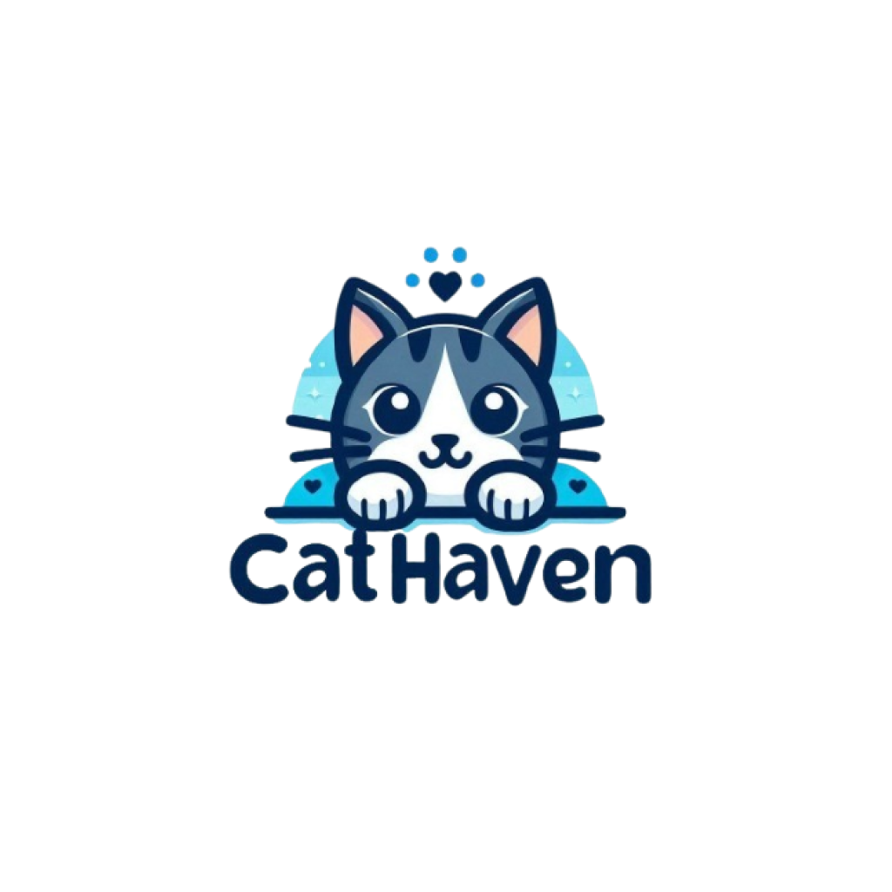

# 🐈‍⬛ Cat Haven
Cat haven is a mobile application for people who love animals, especially cats. Cat haven offers convenience for people who want to do the adoption process without going through a long process. Cat Haven provides a number of features that are certainly easy to use for everyone.


## Authors
- Christian Fernando (535220055) [@CFChristian](https://github.com/CFChristian)
- Ryan Anthony (535220074) [@ryanthony6](https://github.com/ryanthony6) 
- Leonardez Flobert (535220097) [@LazerHart](https://github.com/LazerHart)
- Kevin Natanael (535220084) [@KvJellybean](https://github.com/KvJellyBean)
- Devanska Uzieltama (535220089) [@SanzArrogan](https://github.com/SanzArrogan)

## ⚙️ Tech Stack
- React Native 
- Expo
- Firebase 


## 🧑‍💻Installation
Clone the project

```bash
  git clone https://github.com/KvJellyBean/cat-haven.git
```

Go to the project directory

```bash
  cd cat-haven
```

Install dependencies

```bash
  npm install
```

Start the app

```bash
  npm start
```

Run the app

```bash
  Download expo on your device and scan the QR
```
```bash
  Use Emulator or Android Studio
```


